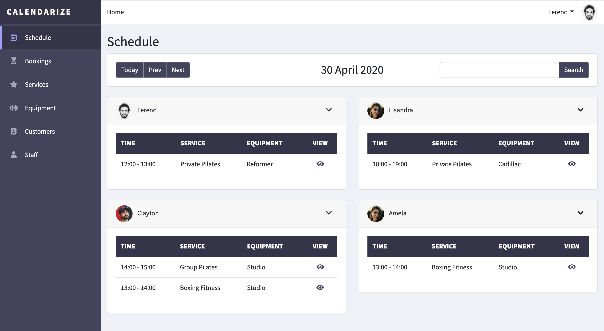

# Calendarize

> Pro Tip: See the how to section below to get the best experience from the application.

This web application serves as a scheduling system for gyms and other health and wellness businesses. The application comprises of 6 modules for staff, service, schedule, equipment, customer and booking management. Each module provides unique views to the user. The desired effect of the application is to enable users to better manage their schedule in order to improve their productivity and therefore increase their revenue. The application was built using four major languages namely HTML, CSS, JavaScript and Python. Together with these languages various libraries and frameworks were used to build the application, all of which are detailed in the deployment section.

## UX

### Function
This project is for gyms and health wellness businesses that would like to better schedule their time. The application allows for multiple users or "Staff" to manage their schedule. In the schedule view the staff are able to see their daily to do's. This view displays the entire teams schedule which includes the functionality to search previous dates and future dates. The additional functionality included, is to support the execution of the above core feature. Such as the ability to add customers, equipment, services and bookings. These features where identified as the minimum viable product for these business to schedule their time. Some similar applications do exist but all require paid subscriptions. Calendarize is free and easy to use and easy to set up as defined in the deployment section.

### Styling
This application was built using the front-end framework called [Bootstrap](https://getbootstrap.com/) with minor adjustments to the default Bootstrap theme to improve responsiveness, custom look and feel. This theme was designed with a dark purple primary base with subtle bright purple accents to create a clean and focused look to the application. The bright purple accents used, draw the attention of the users thereby allowing the application owner to control what the users pay attention to on the application.

The font used is a custom font from [Google Fonts](https://fonts.google.com/?query=Source+Sans+Pro), called Source Sans Pro. The headings are a combination of bold 700 and regular 400 font-weight depending on their location and importance. All other text is regular 400 font-weight. Some additional styling used includes blue and purple links. The colours are based on the functionality of the links and lastly, the icons used are from [Font Awesome](https://fontawesome.com/) which compliments Bootstrap.

### User Stories
- As a developer, I want to expand on the project, so that I can customise the project to my needs without starting from the beginning.
- As an employer/client, I want to hire a capable developer, so I can complete my project successfully.
- As a business owner, I want to improve my teams productivity, so I can improve the profitability of my business.
- As a business owner, I want to improve my teams organization, so I can improve the stability of my business.
- As a business owner, I want to monitor and analyse the business operations, so I can identify areas of improvement.
- As a business owner, I want to know how much to invoice customers, so I can accurately invoice them every month.
- As a business owner, I want to know how much to pay staff, so I can accurately pay their commission every month.
- As a small business owner, I want to use a tool that is free, so I can reduce my expenses.
- As a staff member, I want to better manage my clients, so I can maximize my earning potential.
- As a staff member, I want to see what equipment my colleagues are using, so I don't double book the same equipment.
- As a Code Institue Marker, I want to determine the student has achieved the learning outcomes so that I can score the level of achievement (out of 5).
- As a recruiter, I want to determine the prospects capabilities, so that I can place successful candidates.

### Page Sections

#### Navbar
> This section consists of a full height sidebar that collapses on mobile view. The sidebar consists of the name and the navigation links stacked below one another. The navigation links are pre-pended with Font Awesome icons for ease of identification. When the link is active the block and icon will highlight to indicate you your location in the application.

#### Header
> This section consists of a small full-width bar across the top of the application. This section consists to two major elements. The first element, is the breadcrumb which indicates where you are in relation to the home page. The second element, is the account section which displays your username with a dropdown to logout and your saved profile image.

#### Schedule View
> This section makes up the main content of the display. This section consists of two major elements. The first element, is the filter bar that allows to user to search by date, previous day, next day or today. The second element, is the schedule view of each staff member in a collapse with a nested table to display the relevant bookings for the day.

#### Module List Views (Schedule module excluded)
> This section makes up the main content of the display. This section consists of two major elements. The first element, is the heading with an add new button to add a new record to the module. the second element, is the table which displays a table of records saved in that module. This table has links to edit and delete existing records as well as pagination which is limited to 10 records per view.

#### Module Add / Update Views
> This section makes up the main content of the display. This section consists of one major element. This element is the form(s) related to the module. This form(s) is used for both the create and update view, the only difference being the update view loads pre-populated. In the case where formsets have been used, the element will also include the ability to delete formset forms.

#### Module Delete View / Modal
> This section displays in a modal which is triggered when the user clicks the trash icon in the Module List View. The modal has two options. Firstly, a cancel option to close the modal and keep the record and secondly, a delete option to delete the record from the database.

#### Login Page
> This section makes up the main content of the display with no sidebar or header. The view consists of two major elements. The first element, is a full size image which displays on 50% of the screen (left-hand-side). The second element, is a centered form that requires the users login details (username and password).

#### Password Reset Form
> This section makes up the main content of the display with no sidebar or header. The view consists of two major elements. The first element, is a full size image which displays on 50% of the screen (left-hand-side). The second element, is a centered form that requires the users email address in order to email the password reset link.

#### Password Reset Done
> This section makes up the main content of the display with no sidebar or header. The view consists of two major elements. The first element, is a full size image which displays on 50% of the screen (left-hand-side). The second element, is centered text that notifies the user of the incoming email with password reset link.

#### Password Reset Confirm
> This section makes up the main content of the display with no sidebar or header. The view consists of two major elements. The first element, is a full size image which displays on 50% of the screen (left-hand-side). The second element, is a centered form that requires the user to reset their password (New password and confirm password).

#### Password Reset Complete
> This section makes up the main content of the display with no sidebar or header. The view consists of two major elements. The first element, is a full size image which displays on 50% of the screen (left-hand-side). The second element, is centered text that notifies the user of the successful password reset with a link to login. 

#### Footer
> This application does not utilize a footer as the application functions as a dashboard with no need for a footer.

### Mockups
The project mockups are available below and in the [mockups directory](https://github.com/K0vacs/calendarize/tree/master/app/media/designs) in mobile, tablet and desktop views:

#### Mobile

#### Tablet

#### Desktop

## Features
 
### Existing Features
- Responsiveness - allows the application to render in a user-friendly format on any device (mobile, tablet and desktop)
- Modal - acts as a confirmation message to users when the delete icon is selected
- Sidebar - hides the workout name and metadata on the exercises view to allow for an unobstructed view of exercises on mobile devices
- Form Validation - each form has custom front-end validation which prevents the user from submitting a form without entering all the necessary fields
- The formset on the bookings add/update view allows users to link multiple customers to a booking in order to allow for group bookings to be made 
- The booking add/update view allows users to link equipment, a service and a staff member to a booking in order to combine the other modules data into a usable booking
- The schedule view has search functionality in order to navigate schedules by specific date
- The staff add/update view allows for profile images to be added to staff profiles
- Full CRUD functionality has been added to bookings, services, equipment, customers and staff in order to manage these modules
- The entire application is protected by login authorization in order to protect sensitive business data
- The application has a reset password feature if a user has forgotten their password
- CI/CD is in place with [GitHub](https://github.com/), [Buddy](https://app.buddy.works/mrfkovacs) and [Digital Ocean](https://www.digitalocean.com/) in order to easily deploy new versions of the application
- Easy to deploy your own instance as [Docker](https://www.docker.com/) was used to build the application
- Easy to expand the project as the application has been configured to easily run on local and production (single command)
- A production level deployment with [Nginx](https://www.nginx.com/) and [Gunicorn](https://gunicorn.org/) has been provided to get the best possible performance

### Features to Implement
- Add additional schedule views for weekly and monthly views
- Add a dashboard to display insights from current data
- Invoicing functionality can be added to automatically invoice client bookings
- Link the current pricing options and set the logic to determine priority of each
- Allow for multiple bookings to be created in one view
- Allow for clients to view their bookings in a schedule view
- Allow for clients to make their own bookings which staff may choose to accept
- Create resource contention logic so equipment cannot be over booked
- Create additional levels of privilege in the application (multiple tiers)
- Allow for standard discounts to be applied to services
- Add logic to limit the number of customers that can be added to a single booking
- Add a support feature to log defects

## Technologies Used

### Languages
- HTML / HTML5 - To display content on each HTML page and enable the use of more semantic elements used in HTML5.
- CSS / CSS3 - To style content in each HTML page and enable additional styling features by using CSS3.
- JavaScript - To make HTML content more dynamic and to enable features that are supported by Bootstrap and jQuery.
- Python - To make the application more performant, secure and deepen the functionality with a backend language. 

### Additional Tools
- Bootstrap - to speed up the building of the project using the front end framework that has been tried and tested.
- Font Awesome - To make the project more visually appealing to users through the use of icons.
- Google Fonts - To make enable custom fonts to be used in the project. Source Sans Pro was selected.
- jQuery - To simplify DOM manipulation and to enable Bootstrap and dynamic features.
- Django - To simplify and speed up the building of a Python project, this includes the Django dependencies and; 
    - Django - To use the Django framework as the base of the project
    - mysqlclient - To enable Django models to communicate with the MySQL database
    - python-dotenv - To enable the use of a .env file in order to protect sensitive data
    - django-bootstrap4 - To enable the use of Bootstrap with Jinga2 template language
    - Pillow - To enable images to be uploaded using Django forms
    - django-bootstrap-datepicker-plus - To enable a Bootstrap friendly date picker on form fields
    - gunicorn - To build a production level python application server
    - django-view-breadcrumbs - To easily build breadcrumbs in Django
- Nginx - To enable a reverse proxy server in order to serve the production application faster
- Docker - To enable to use of containerization in order to abstract the application from hosting, networking and environment configurations
- MySQL - To enable the storage of data in a relational format
- Buddy - To enable a runner that deploys Github repository code to the relevant host server
- Digital Ocean - To enable a host server for the application
- Git/Github - To track changes to the application and store application code online (also has collaboration benefits)

## Testing
This project was tested using the Google Chrome Inspect tool. Using the aforementioned tool the website was tested using multiple screen sizes. These screen sizes include various mobile, tablet, and desktop sizes using both portrait and landscape views. The Jasmine automated testing tool and Python unit testing tools were considered but proved unnecessary as very few functions return a specific int or string result.

The following checks were done to ensure the website is working as intended:
- All links working and directed correctly
- All styles applied and display correctly
- All icons displayed with the intended styling
- All navigation elements are working as intended
- All modals are operating as intended
- Form fields are all required on submit
- Form uploads are uploaded to the media directory as expected
- Updating uploads are removed and replaced as expected
- Forms create/update and delete as expected
- MySQL records are inline with each view
- Database records are saved in the expected layout and type
- Nginx and Gunicorn are serving requests as expected
- W3C validator HTML errors fixed
- W3C validator CSS errors fixed
- Google Dev Tools Audit run and fixed issues on each page
- JSHint errors and warnings fixed (for all that were necessary
- JavaScript Ajax functions return the appropriate error when a failure occurs

## Deployment

### This Deployment
This project has been deployed on a Digital Ocean droplet using the following method:
- A Visual Studio Code workspace was created and the calendarize directory was created
- Docker was installed to run images and containers locally
- A GitHub repo was created and linked to the Visual Studio Code Git instance
- The Dockerfiles and Docker Compose yml file were created to run the necessary instances
    - Django instance was created to build the backend and frontend code
    - MySQL instance was created an linked to the django container
    - Nginx instance was created to enable a reverse proxy server for production
- The GitHub repo was connected to the Digital Ocean Droplet using the [Buddy](https://buddy.works/) application which allows for automatic deployment from the GitHub master branch which redeploys on every commit to the master branch
- The Django application was configured to the Digital Ocean Droplet through Buddy by copying the repo to Digital Ocean and then running a docker stop and docker compose command to stop and restart the container. The environment variables were added to the .env files on the server

> The deployed version is the latest version of the application

### Deploy your Own

#### Local
To deploy this application on your local machine, do the following:
- Clone the repository from this page using the clone or download button which will copy the clone link to your clipboard
- Using your chosen IDE initialize git and clone the repo using the clone link
- Download and install Docker in order to run the project
- Once complete install the necessary dependencies and run the containers for the application using "docker-compose up" in your command-line interface
- Once complete your application should be running on [here](http://localhost:8000)
- Create a GitHub repo and connect it to your IDE version of the application by following the setup instructions on GitHub

#### Production
To deploy this application on your own sever, do the following:
- Clone the repository from this page using the clone or download button which will copy the clone link to your clipboard
- Using your chosen IDE initialize git and clone the repo using the clone link
- Create a GitHub repo and connect it to your IDE version of the application by following the setup instructions on GitHub
- Create a Digital Ocean Droplet by using the reconfigured Docker images
- Create a Buddy account and connect it to your newly created GitHub Repo. Then create a Buddy pipeline that copies your repository code and connects to you Digital Ocean Droplet and stops all containers and restarts them.
- In the command line interface on Buddy make sure to use the command "docker-compose -f docker-compose.yml -f docker-compose.prod.yml up -d" to restart the containers using the production config
- Complete an initial commit, push it to GitHub and troubleshoot the results on the Buddy pipeline

## Contribute
Developer contributions are welcomed and encouraged.

To contribute just fork the GitHub repository, follow the deployment instructions and when ready create a push request with detailed notes of the changes which will be reviewed and added to the project on success.

Feel free to pick up any of the above-mentioned features left to implement.

## Credits

### Content
- The icons used in this project are from [Font Awesome](https://fontawesome.com/).
- Most elements of this website use [Bootstrap](https://getbootstrap.com/) elements.
- The fonts were selected from [Google Fonts](https://fonts.google.com/).
- The profile images were selected from [Unsplash](https://unsplash.com/)

### Acknowledgements
- [Responsinator](http://www.responsinator.com/) was used to check mobile and tablet responsiveness.
- [TinyPNG](https://tinypng.com/) was used to compress images.
- [Adobe XD](https://www.adobe.com/) was used to create the project mockups.
- The [Docker](https://docs.docker.com/) documentation was used to setup the Docker files.
- [Buddy](https://buddy.works/) was used to to build the deployment pipeline.